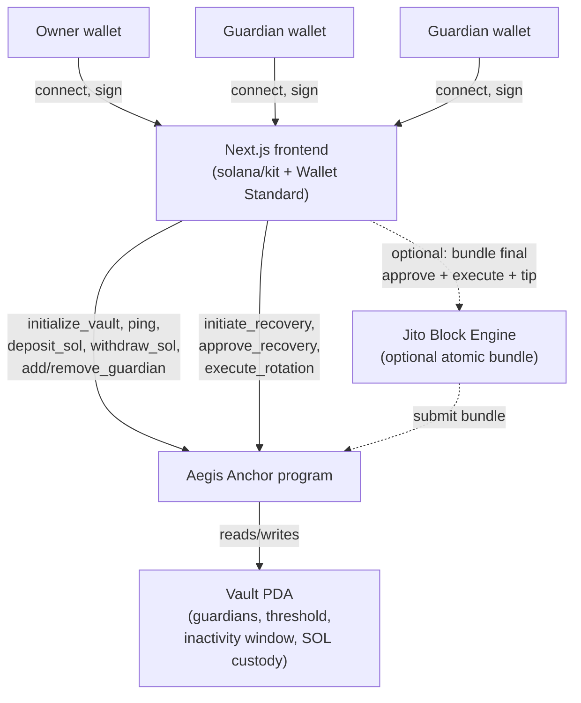

# Aegis

> Live app: [aegis-protocol-dusky.vercel.app](https://aegis-protocol-dusky.vercel.app/)

Monorepo containing the Aegis Anchor program (`programs/aegis_program`) and the Next.js frontend (`frontend`).

## Architecture



The Vault PDA is derived from the creating wallet's address and stores guardians, the
approval threshold, the inactivity window, and recovery state, and also holds SOL directly
(deposits/withdrawals move lamports in/out of this same account). Rotating ownership only
ever updates the `owner` field on this account; guardians never gain direct access to the
funds themselves.

## Documentation

- [Frontend README](frontend/README.md): stack, setup, environment variables, project
  structure, and how the dashboard maps to on-chain instructions.
- [Program README](programs/aegis_program/README.md): account layout, every instruction and
  error code, and how to build/test/deploy the Anchor program.

## Prerequisites

- [Node.js](https://nodejs.org/) 20+
- [pnpm](https://pnpm.io/) 9+ (`corepack enable` or `npm i -g pnpm`)
- [Yarn](https://yarnpkg.com/) (used by the Anchor program)
- [Rust](https://www.rust-lang.org/tools/install) (toolchain `1.89.0`, see `programs/aegis_program/rust-toolchain.toml`)
- [Solana CLI](https://docs.solana.com/cli/install-solana-cli-tools)
- [Anchor CLI](https://www.anchor-lang.com/docs/installation)

## Setup

Install frontend dependencies (run from the repo root, this is a pnpm workspace):

```bash
pnpm install
```

Install Anchor program dependencies:

```bash
cd programs/aegis_program
yarn install
```

## Running the frontend

From the repo root:

```bash
pnpm dev
```

Other useful scripts (run from the repo root):

```bash
pnpm build       # production build
pnpm lint        # lint
pnpm format      # format with prettier
pnpm typecheck   # type-check
```

## Working with the Anchor program

From the repo root:

```bash
pnpm anchor:build   # anchor build
pnpm anchor:test    # anchor build && cargo test (litesvm)
pnpm anchor:lint    # lint the program's TS files
```

Or run commands directly from `programs/aegis_program`:

```bash
cd programs/aegis_program
anchor build
yarn test
```

See [programs/aegis_program/README.md](programs/aegis_program/README.md) for details on the
program's instructions, accounts, and test suite.

## Deployment

The Aegis program is deployed on Solana Devnet, and the frontend is live on Vercel:

- **Live app:** [aegis-protocol-dusky.vercel.app](https://aegis-protocol-dusky.vercel.app/)
- **Program ID:** `8zA1db5LJmFwUu7dTS1qA4ixqJ5XaTx224x1fRTRSJHA`
- **Explorer:** [Program](https://explorer.solana.com/address/8zA1db5LJmFwUu7dTS1qA4ixqJ5XaTx224x1fRTRSJHA?cluster=devnet)

## Project structure

```
.
├── frontend/                # Next.js + shadcn/ui app
└── programs/
    └── aegis_program/        # Anchor program (Rust) + tests
```
